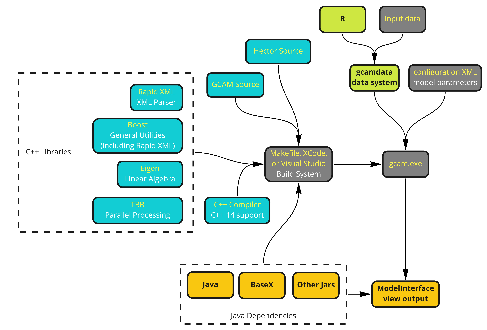
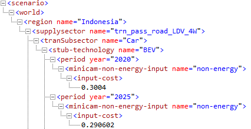

```{r child = 'header.rmd'}
```

<!-------------------------->
<!-------------------------->
# Key Links
<!-------------------------->
<!-------------------------->
<p align="center"> </p>

<br>

```{r key links table, results = 'show', eval=TRUE, echo=FALSE, warning=FALSE, error = FALSE, message = FALSE}
library(kableExtra); library(dplyr)

data.frame(
  Description = c("Official Documentation",
                  "FAQs, issues and discussions"),
  Link = c("http://jgcri.github.io/gcam-doc/index.html",
           "https://github.com/JGCRI/gcam-core/discussions")) %>%
  kable("html", escape = FALSE) %>%
  kable_styling(bootstrap_options = c("bordered","striped", "hover", "condensed", "responsive")) %>%
  row_spec(0, background = "#2A2A2A", color = "white")
```

<br>

<!-------------------------->
<!-------------------------->
# Tutorials
<!-------------------------->
<!-------------------------->
<p align="center"> </p>

This section lists videos and presentations for selected releases of GCAM. These materials are usually presented at the GCAM annual meeting and curated here as a persistent reference.

<br>

## GCAM 6.0
***

```{r gcam6p0 links, results = 'show', eval=TRUE, echo=FALSE, warning=FALSE, error = FALSE, message = FALSE}
library(kableExtra); library(dplyr)

dt_url <- c("https://github.com/JGCRI/gcam_training/blob/main/presentations/gcam6p0_walkthrough.pdf")

data.frame(
  File = c("gcam6p0_walkthrough.pdf"),
  Description = c("GCAM 6.0 walkthrough presentation")) %>%
  dplyr::mutate(Location = cell_spec(rep("Link",length(dt_url)),"html",link=dt_url)) %>%
  kable("html", escape = FALSE) %>%
  kable_styling(bootstrap_options = c("bordered","striped", "hover", "condensed", "responsive")) %>%
  row_spec(0, background = "#2A2A2A", color = "white")
```

<div class="video_box">
<figure>
  <figcaption>GCAM 6.0 Install Windows</figcaption>
  <iframe width="200" height="200" src="https://www.youtube.com/embed/EGxh-MFqRIs?rel=0" frameborder="0" allowfullscreen></iframe>
</figure>
</div>

<div class="video_box">
<figure>
  <figcaption>GCAM 6.0 Install MacOS</figcaption>
  <iframe width="200" height="200" src="https://www.youtube.com/embed/c8DmPHHO6DA&t=2s?rel=0" frameborder="0" allowfullscreen></iframe>
</figure>
</div>

<br>

## GCAM 5.4
***

```{r gcam5p4 links, results = 'show', eval=TRUE, echo=FALSE, warning=FALSE, error = FALSE, message = FALSE}
library(kableExtra); library(dplyr)

dt_url <- c("https://github.com/JGCRI/gcam_training/blob/main/presentations/gcam5p4_overview.pdf",
            "https://github.com/JGCRI/gcam_training/blob/main/presentations/gcam5p4_walkthrough.pdf")

data.frame(
  File = c("gcam5p4_overview.pdf",
           "gcam5p4_walkthrough.pdf"),
  Description = c("GCAM 5.4 overview presentation",
                  "GCAM 5.4 walkthrough presentation")) %>%
  dplyr::mutate(Location = cell_spec(rep("Link",length(dt_url)),"html",link=dt_url)) %>%
  kable("html", escape = FALSE) %>%
  kable_styling(bootstrap_options = c("bordered","striped", "hover", "condensed", "responsive")) %>%
  row_spec(0, background = "#2A2A2A", color = "white")
```


<div class="video_box">
<figure>
  <figcaption>GCAM 5.4 Overview</figcaption>
  <iframe width="200" height="200" src="https://www.youtube.com/embed/13tBgM_JWXc?rel=0" frameborder="0" allowfullscreen></iframe>
</figure>
</div>


<div class="video_box">
<figure>
  <figcaption>What's new in GCAM 5.4?</figcaption>
  <iframe width="200" height="200" src="https://www.youtube.com/embed/SI61E7_VJ-E?rel=0" frameborder="0" allowfullscreen></iframe>
</figure>
</div>

<br>

## GCAM Software Map

<p style='margin-bottom:1em; margin-left:1em; text-align:center;'> 
<br>
```{r, echo=FALSE, out.width="60%", fig.align='center'}

```
</p>

<br>

<!-------------------------->
<!-------------------------->
# Scenario Adjustments
<!-------------------------->
<!-------------------------->
<p align="center"> </p>


This section details how to adjust scenarios in GCAM to explore different policy and technology pathways or objectives. The list will continue to be expanded on as we gather relevant examples and use-cases. For each scenario adjustment we provide: 

- Relevant example files 
- Goal of the adjustment
- General approach
- Relevant background information related to the adjustment
- Step-by-step guide to implementing the adjustment in GCAM
- Example outputs


## Electricity Generation Mix
***
<b style="font-size:120%;color:#900C3F;">
Note: Last Tested using GCAM 6.0</b>


```{r electricity generation files table, results = 'show', eval=TRUE, echo=FALSE, warning=FALSE, error = FALSE, message = FALSE}
library(kableExtra); library(dplyr)

dt_url <- c("https://github.com/JGCRI/gcam_training/blob/main/examples/electricity_generation_constraints.xml",
            "https://github.com/JGCRI/gcam_training/blob/main/examples/electricity_generation_constraint_techs.xml")

data.frame(
  "Example addon XMLs" = c("indonesia_electricity_generation_constraints.xml",
                           "indonesia_electricity_generation_techs.xml"),
  Description = c("Setting constraints: floors for wind and solar; ceiling for coal",
                  "Applying constraints to electricity generation technologies")) %>%
  dplyr::mutate(Location = cell_spec(rep("Link",length(dt_url)),"html",link=dt_url)) %>%
  kable("html", escape = FALSE, col.names = c("Files Used", "Description", "Link")) %>%
  kable_styling(bootstrap_options = c("striped", "hover", "condensed", "responsive")) %>%
  row_spec(0, background = "#2A2A2A", color = "white")
```


<!-------------------------->
<!----------Goal------------>
<!-------------------------->

<div class="warning" style='background-color:#E1F4F5; border-left: solid #1f1f1f 4px; border-radius: 4px; padding:0.7em;'>
<span>
<p style='text-align:center; font-size:24px'>
<b>Goal</b>
</p>

<p style='margin-left:1em;'>
This example demonstrates how to set floors and ceilings for electricity generation by fuel in GCAM. We will set floors (minimum required generation amounts) for wind and solar and a ceiling (maximum generation amount) for coal from 2025 through 2040.

</p>
</span>
</div>

<br>


<!-------------------------->
<!--------Approach---------->
<!-------------------------->

<div class="warning" style='background-color:#fffae0; border-left: solid #1f1f1f 4px; border-radius: 4px; padding:0.7em;'>
<span>

<p style='text-align:center; font-size:24px'>
<b>Approach</b></p>

<p style='margin-left:1em;'>
We can use a `policy-portfolio-standard` to set floors and ceilings for each fuel. This will decrease (increase) the cost of the electricity generation technologies until the floor (ceiling) is satisfied. 

</p>
</span>
</div>

<br>


<!-------------------------->
<!--------Background-------->
<!-------------------------->

```{r child = 'background_policy-portfolio-standards.rmd'}
```


<!-------------------------->
<!---GCAM Implementation---->
<!-------------------------->

<div class="warning" style='background-color:#F5E5E1; border-left: solid #1f1f1f 4px; border-radius: 4px; padding:0.7em;'>
<span>
<p style='text-align:center; font-size:24px'>
<b>GCAM Implementation</b>
</p>

<p style='margin-left:1em;'>
1. Create a folder in the input directory eg. `./gcam-core/input/addons`.
2. Download the example xml files [electricity_generation_constraints.xml](https://github.com/JGCRI/gcam_training/blob/main/examples/electricity_generation_constraints.xml) and [electricity_generation_constraint_techs.xml](https://github.com/JGCRI/gcam_training/blob/main/examples/electricity_generation_constraint_techs.xml) to the folder.
4. Within each `policy-portfolio-standard` tag in the first XML, adjust the following:
</p>

<ul style='margin-left:4em; text-align:left;'>
  <li>`constraint` for each year in which a floor is desired</li>
  <li>Set `min-price` to a large negative value for years in which an exact constraint, rather than a floor, is desired</li>
</ul>
<p style='margin-left:1em;'>
5. Within each `supplysector` tag in the second XML, make sure that the corresponding `input-subsidy` is added within each relevant `period` for each `stub-technology` you wish to include in the constraint.


<p style='margin-bottom:1em; margin-left:1em; text-align:center;'> 
<b>Example XML structures</b> 
<br>

<i>Note: `min-price` should be set to a large negative number (e.g., -10000) for years in which an exact constraint is desired rather than a floor or ceiling. Otherwise, it can remain at the default (0).</i>
</p>


6. Save the XMLs and then point to them in your configuration file by adding the lines: 
<p style='font-size:0.8em'>
`<Value name = "scen">../input/addons//electricity_generation_constraints.xml</Value>`
`<Value name = "scen">../input/addons//electricity_generation_constraint_techs.xml</Value>`

</p>
</p>

</span>
</div>

<br>

<!-------------------------->
<!------Example Output------>
<!-------------------------->

<div class="warning" style='background-color:#efe1f5; border-left: solid #1f1f1f 4px; border-radius: 4px; padding:0.7em;'>
<span>
<p style='text-align:center; font-size:24px'>
<b>Example Output</b>
</p>


<p style='margin-bottom:1em; margin-left:1em; text-align:center;'> 
<br>

</p>


</span>
</div>

<br>


## Building Envelope Efficiency
***
<b style="font-size:120%;color:#900C3F;">
Note: Last Tested using GCAM 6.0</b>

```{r shell files table, results = 'show', eval=TRUE, echo=FALSE, warning=FALSE, error = FALSE, message = FALSE}
library(kableExtra); library(dplyr)

dt_url <- c("https://github.com/JGCRI/gcam_training/blob/main/examples/buildings_shell_efficiency.xml")

data.frame(
  "Files Used" = c("buildings_shell_efficiency.xml"),
  Description = c("Modifies shell conductance to represent enhanced building envelope efficiency improvement")) %>%
  dplyr::mutate(Location = cell_spec(rep("Link",length(dt_url)),"html",link=dt_url)) %>%
  kable("html", escape = FALSE, col.names = c("Files Used", "Description", "Link")) %>%
  kable_styling(bootstrap_options = c("striped", "hover", "condensed", "responsive")) %>%
  row_spec(0, background = "#2A2A2A", color = "white")
```


<!-------------------------->
<!----------Goal------------>
<!-------------------------->

<div class="warning" style='background-color:#E1F4F5; border-left: solid #1f1f1f 4px; border-radius: 4px; padding:0.7em;'>
<span>
<p style='text-align:center; font-size:24px'>
<b>Goal</b>
</p>

<p style='margin-left:1em;'>
This example demonstrates how to modify building envelope efficiencies in GCAM. We will increase efficiency over time, which could be used to represent increasing compliance with the envelope efficiency component of building energy codes. 

</p>
</span>
</div>

<br>


<!-------------------------->
<!--------Approach---------->
<!-------------------------->

<div class="warning" style='background-color:#fffae0; border-left: solid #1f1f1f 4px; border-radius: 4px; padding:0.7em;'>
<span>

<p style='text-align:center; font-size:24px'>
<b>Approach</b></p>
We can use GCAM's `shell-conductance` parameter to represent an increase in building envelope efficiency.
<p style='margin-left:1em;'>

</p>


</span>
</div>

<br>


<!-------------------------->
<!--------Background---------->
<!-------------------------->

```{r child = 'background_coolingDemand.rmd'}
```


<!-------------------------->
<!---GCAM Implementation---->
<!-------------------------->

<div class="warning" style='background-color:#F5E5E1; border-left: solid #1f1f1f 4px; border-radius: 4px; padding:0.7em;'>
<span>
<p style='text-align:center; font-size:24px'>
<b>GCAM Implementation</b>
</p>

<p style='margin-left:1em;'>
1. Create a folder in the input directory: `./gcam-core/input/addons`.
2. Download the example xml file [buildings_shell_efficiency.xml](https://github.com/JGCRI/gcam_training/blob/main/examples/buildings_shell_efficiency.xml) to the folder.
4. Within each `gcam-consumer` tag in the XML, specify the desired `shell-conductance` values for each year.

<p style='margin-bottom:1em; margin-left:1em; text-align:center;'> 
<b>Example XML structure</b> 
<br>

</p>

5. Save the xml and then point to it in your configuration file by adding the line: 
<p style='font-size:0.8em'>
`<Value name = "scen">../input/addons/buildings_shell_efficiency.xml</Value>`
</p>

</span>
</div>

<br>

<!-------------------------->
<!------Example Output------>
<!-------------------------->

<div class="warning" style='background-color:#efe1f5; border-left: solid #1f1f1f 4px; border-radius: 4px; padding:0.7em;'>
<span>
<p style='text-align:center; font-size:24px'>
<b>Example Output</b>
</p>


<p style='margin-bottom:1em; margin-left:1em; text-align:center;'> 
<br>

</p>


</span>
</div>

<br>

## Modifying technology costs - EVs
***

<b style="font-size:120%;color:#900C3F;">
Note: Last Tested using GCAM 6.0</b>

```{r EV cost parity files table, results = 'show', eval=TRUE, echo=FALSE, warning=FALSE, error = FALSE, message = FALSE}
library(kableExtra); library(dplyr)

dt_url <- c("https://github.com/JGCRI/gcam_training/blob/main/examples/transportation_UCD_CORE.xml",
            "https://github.com/JGCRI/gcam_training/blob/main/examples/adjust_ev_tech_cost.xml")

data.frame(
  "Files Used" = c("transportation_UCD_CORE.csv",
           "adjust_ev_tech_cost.xml"),
  Description = c("XML containing reference transportation technology costs",
              "XML for modifying 4-wheel passenger BEV costs")) %>%
  dplyr::mutate(Location = cell_spec(rep("Link",length(dt_url)),"html",link=dt_url)) %>%
  kable("html", escape = FALSE, col.names = c("Files Used", "Description", "Link")) %>%
  kable_styling(bootstrap_options = c("striped", "hover", "condensed", "responsive")) %>%
  row_spec(0, background = "#2A2A2A", color = "white")
```


<!-------------------------->
<!----------Goal------------>
<!-------------------------->

<div class="warning" style='background-color:#E1F4F5; border-left: solid #1f1f1f 4px; border-radius: 4px; padding:0.7em;'>
<span>
<p style='text-align:center; font-size:24px'>
<b>Goal</b>
</p>

<p style='margin-left:1em;'>
This example demonstrates how to modify non-energy costs of transportation technologies in GCAM. We will decrease these costs for 4-wheel passenger BEVs from 2020 to 2050 to represent policies that lower EV costs.

</p>
</span>
</div>

<br>


<!-------------------------->
<!--------Approach---------->
<!-------------------------->

<div class="warning" style='background-color:#fffae0; border-left: solid #1f1f1f 4px; border-radius: 4px; padding:0.7em;'>
<span>

<p style='text-align:center; font-size:24px'>
<b>Approach</b></p>

<p style='margin-left:1em;'>
We can use GCAM's `input-cost` parameter, which represents the non-energy costs of a given technology.
</p>


</span>
</div>

<br>


<!--------------------------->
<!--------Background--------->
<!--------------------------->


<!-------------------------->
<!---GCAM Implementation---->
<!-------------------------->

<div class="warning" style='background-color:#F5E5E1; border-left: solid #1f1f1f 4px; border-radius: 4px; padding:0.7em;'>
<span>
<p style='text-align:center; font-size:24px'>
<b>GCAM Implementation</b>
</p>

<p style='margin-left:1em;'>
1. Create a folder in the input directory: `./gcam-core/input/addons`.
2. Download the example xml file [adjust_ev_cost.xml](https://github.com/JGCRI/gcam_training/blob/main/examples/adjust_ev_tech_cost.xml) to the folder.
4. In each appropriate `stub-technology` tag (within each `tranSubsector` tag) in the XML, set the desired `input-cost` for each year. Add other `supplysector` tags to include technologies outside of 4-wheel LDVs.

<p style='margin-bottom:1em; margin-left:1em; text-align:center;'> 
<b>Example XML structure</b> 
<br>

</p>

5. Save the xml and then point to it in your configuration file by adding the line: 
</p>
<p style='font-size:0.8em'>
`<Value name = "scen">../input/addons/adjust_ev_tech_cost.xml</Value>`
</p>
</p>

</span>
</div>

<br>


## Transport Mode Shift - Share weights
***

<b style="font-size:120%;color:#900C3F;">
Note: Last Tested using GCAM 6.0</b>

```{r shareweight files table, results = 'show', eval=TRUE, echo=FALSE, warning=FALSE, error = FALSE, message = FALSE}
library(kableExtra); library(dplyr)

dt_url <- c("https://github.com/JGCRI/gcam_training/blob/main/examples/adjust_shareweight_rail.xml")

data.frame(
  "Files Used" = c("adjust_shareweight_rail.xml"),
  Description = c("XML for setting passenger rail share weight dynamics")) %>%
  dplyr::mutate(Location = cell_spec(rep("Link",length(dt_url)),"html",link=dt_url)) %>%
  kable("html", escape = FALSE, col.names = c("Files Used", "Description", "Link")) %>%
  kable_styling(bootstrap_options = c("striped", "hover", "condensed", "responsive")) %>%
  row_spec(0, background = "#2A2A2A", color = "white")
```


<!-------------------------->
<!----------Goal------------>
<!-------------------------->

<div class="warning" style='background-color:#E1F4F5; border-left: solid #1f1f1f 4px; border-radius: 4px; padding:0.7em;'>
<span>
<p style='text-align:center; font-size:24px'>
<b>Goal</b>
</p>

<p style='margin-left:1em;'>
This example demonstrates how to adjust share-weights in GCAM. We will increase the share-weight of passenger rail transport over time to represent policies that increase rail infrastructure.

</p>
</span>
</div>

<br>


<!-------------------------->
<!--------Approach---------->
<!-------------------------->

<div class="warning" style='background-color:#fffae0; border-left: solid #1f1f1f 4px; border-radius: 4px; padding:0.7em;'>
<span>

<p style='text-align:center; font-size:24px'>
<b>Approach</b></p>

<p style='margin-left:1em;'>
Since infrastructure development is a non-cost impact on rail transport, we can use share weights to represent this impact. Share weights are calibration parameters and not directly related to any "real-world" value, so it is usually necessary to test a range of share weight modifications to obtain the desired effect. The Model Interface query `transport subsector share-weights` can be used to check the reference share weights for transportation modes.
</p>

</span>
</div>

<br>


<!-------------------------->
<!--------Background---------->
<!-------------------------->

```{r child = 'background_shareweights.rmd'}
```


<!-------------------------->
<!---GCAM Implementation---->
<!-------------------------->

<div class="warning" style='background-color:#F5E5E1; border-left: solid #1f1f1f 4px; border-radius: 4px; padding:0.7em;'>
<span>
<p style='text-align:center; font-size:24px'>
<b>GCAM Implementation</b>
</p>

<p style='margin-left:1em;'>
1. Create a folder in the input directory: `./gcam-core/input/addons`.
2. Download the example xml file [adjust_shareweight_rail.xml](https://github.com/JGCRI/gcam_training/blob/main/examples/adjust_shareweight_rail.xml) to the folder.
4. Adjust share weights and interpolation rules (`linear`, `fixed`, or `s-curve`) to the "Passenger Rail" `tranSubsector` tag in the XML. Add/ remove subsectors as desired.
</p>

<p style='margin-bottom:1em; margin-left:1em; text-align:center;'> 
<b>Example xml structure</b> 
<br>

<br>
<i>Note: The first interpolation rule must include delete="1" in order to override all of the previous (default) interpolation rules.</i>
</p>

<p style='margin-left:1em;'>
7. Save the xml and then point to it in your configuration file by adding the lines: 
<p style='font-size:0.8em'>
`<Value name = "scen">../input/addons/adjust_shareweight_rail.xml</Value>`
</p>
</p>

</span>
</div>

<br>

<!-- <!-------------------------->
<!-- # Batch runs -->
<!-- <!-------------------------->
<!-- <p align="center"> </p> -->

<!-- <br> -->

<!-- <!-------------------------->
<!-- # Parallel runs -->
<!-- <!-------------------------->
<!-- <p align="center"> </p> -->

<!-- <br> -->

<!-------------------------->
# gcamdata
<!-------------------------->
<p align="center"> </p>

<div class="video_box">
<figure>
  <figcaption>gcamdata renv</figcaption>
  <iframe width="200" height="200" src="https://www.youtube.com/embed/EO6NPCf7lKc?rel=0" frameborder="0" allowfullscreen></iframe>
</figure>
</div>

<div class="video_box">
<figure>
  <figcaption>gcamdata User Functions</figcaption>
  <iframe width="200" height="200" src="https://www.youtube.com/embed/S9PwWAEpLIE?rel=0" frameborder="0" allowfullscreen></iframe>
</figure>
</div>

<br>

<!-- <!-------------------------->
<!-- # XMLs -->
<!-- <!-------------------------->
<!-- <p align="center"> </p> -->

<!-- ## Create XML from csv -->
<!-- *** -->

<!-- <br> -->

<!-------------------------->
# Extracting GCAM data
<!-------------------------->
<!-- <p align="center"> </p> -->

<!-- ## rgcam -->
<!-- *** -->

<!-- ## modelInterface -->
<!-- *** -->

## gcamextractor
<!-- *** -->

`gcamextractor` is an R package which allows users to extract selected parameters from a GCAM database into standardized tables with consistent column names for easier downstream plotting and analysis. `gcamextractor` also converts the extracted data into more commonly used units. Detailed documentation for `gcamextractor` can be found in the [user guide](https://jgcri.github.io/gcamextractor/). A simple example is provided below on how to extract data from GCAM using `gcamextractor` in `R`. Users can select individual parameters listed [here](https://jgcri.github.io/gcamextractor/articles/vignette_parameters.html) or simply select `summary` for a selection of commonly used diagnostic parameters.


```{r, eval=F}
# In R
# devtools::install_github("JGCRI/gcamextractor")
library(gcamextractor)

data <- gcamextractor::readgcam(gcamdatabase = "FULL/PATH/TO/GCAM_DATABASE",
                                paramsSelect = c("pop","elecByTechTWh"),
                                regionsSelect = c("Argentina","Colombia"))
```


<!-- ## Argus -->
<!-- *** -->

<!-------------------------->
# Git
<!-------------------------->
<p align="center"> </p>

## From Stash(Bitbucket) to Github

This section discussed how to push a development branch of GCAM from stash onto github.

<div class="warning" style='background-color:#fffae0; border-left: solid #1f1f1f 4px; border-radius: 4px; padding:0.7em;'>
<span>
<p style='margin-top:1em; text-align:center'>
<b>From Stash to Github</b></p>
<p style='margin-left:1em;'>
1. Create a new repository in github: https://github.com/new
2. Give it a relevant name such as `gcam_v5p4_projectx`
3. Copy the clone address of the new repo e.g. https://github.com/USERNAME/gcam_v5p4_projectx.git
4. Push your local stash branch changes up to this branch: 
<p>`git push https://github.com/USERNAME/gcam_v5p4_projectx.git local_branch_name:new_branch_name`</p>
5. Continue to work stash branch as usual and also push up latest changes to github as above.
<p>
```
git status
git add files_changed 
git commit -m "commit message"
git push https://github.com/USERNAME/gcam_v5p4_projectx.git local_branch_name:new_branch_name
```
</p>
</p></span>
</div>
