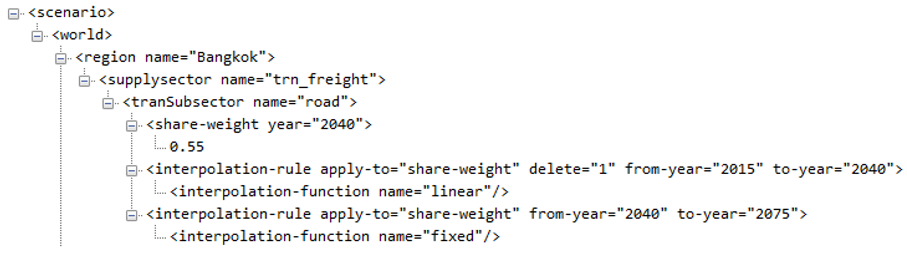

<div class="header_logo">


</div>

<!-------------------------->
# Key Links
<!-------------------------->
<p align="center"> </p>

<br>

```{r key links table, results = 'show', eval=TRUE, echo=FALSE, warning=FALSE, error = FALSE, message = FALSE}
library(kableExtra); library(dplyr)

data.frame(
  Description = c("Official Documentation",
                  "FAQs, issues and discussions"),
  Link = c("http://jgcri.github.io/gcam-doc/index.html",
           "https://github.com/JGCRI/gcam-core/discussions")) %>%
  kable("html", escape = FALSE) %>%
  kable_styling(bootstrap_options = c("bordered","striped", "hover", "condensed", "responsive")) %>%
  row_spec(0, background = "#2A2A2A", color = "white")
```

<br>

<!-------------------------->
# Tutorials
<!-------------------------->
<p align="center"> </p>

<br>

## GCAM 5.4
***

```{r presentation links table, results = 'show', eval=TRUE, echo=FALSE, warning=FALSE, error = FALSE, message = FALSE}
library(kableExtra); library(dplyr)

dt_url <- c("https://github.com/JGCRI/gcam_training/blob/main/presentations/gcam5p4_overview.pdf",
            "https://github.com/JGCRI/gcam_training/blob/main/presentations/gcam5p4_walkthrough.pdf")

data.frame(
  File = c("gcam5p4_overview.pdf",
           "gcam5p4_walkthrough.pdf"),
  Description = c("GCAM 5.4 overview presentation",
                  "GCAM 5.4 walkthrough presentation")) %>%
  dplyr::mutate(Location = cell_spec(rep("Link",length(dt_url)),"html",link=dt_url)) %>%
  kable("html", escape = FALSE) %>%
  kable_styling(bootstrap_options = c("bordered","striped", "hover", "condensed", "responsive")) %>%
  row_spec(0, background = "#2A2A2A", color = "white")
```


<div class="video_box">
<figure>
  <figcaption>GCAM 5.4 Overview</figcaption>
  <iframe width="200" height="200" src="https://www.youtube.com/embed/13tBgM_JWXc?rel=0" frameborder="0" allowfullscreen></iframe>
</figure>
</div>


<div class="video_box">
<figure>
  <figcaption>What's new in GCAM 5.4?</figcaption>
  <iframe width="200" height="200" src="https://www.youtube.com/embed/SI61E7_VJ-E?rel=0" frameborder="0" allowfullscreen></iframe>
</figure>
</div>

<br>

<!-------------------------->
# Scenario Adjustments
<!-------------------------->
<p align="center"> </p>

## Transport Mix - Shareweights
***

```{r shareweight files table, results = 'show', eval=TRUE, echo=FALSE, warning=FALSE, error = FALSE, message = FALSE}
library(kableExtra); library(dplyr)

dt_url <- c("https://github.com/JGCRI/gcam_training/blob/main/examples/subsector_shareweights_ref.csv",
            "https://github.com/JGCRI/gcam_training/blob/main/examples/transportation_Subregions_Thailand.xml",
            "https://github.com/JGCRI/gcam_training/blob/main/examples/freight_rail_0034_2040_lin.xml",
            "https://github.com/JGCRI/gcam_training/blob/main/examples/freight_road_55_2040_lin.xml")

data.frame(
  "Files Used" = c("subsector_shareweights_ref.csv",
           "transportation_Subregions_Thailand.xml",
           "freight_rail_0034_2040_lin.xml",
           "freight_road_55_2040_lin.xml"),
  Description = c("Reference shareweights from Model Interface",
              "Existing default xml",
              "Linear interpolation from default 2015 value (0.001342) to 0.0034 in 2040 for freight rail",
              "Linear interpolation from default 2015 value (1) to 0.55 in 2040 for freight road")) %>%
  dplyr::mutate(Location = cell_spec(rep("Link",length(dt_url)),"html",link=dt_url)) %>%
  kable("html", escape = FALSE, col.names = c("Files Used", "Description", "Link")) %>%
  kable_styling(bootstrap_options = c("striped", "hover", "condensed", "responsive")) %>%
  row_spec(0, background = "#2A2A2A", color = "white")
```


<div class="warning" style='background-color:#E1F4F5; border-left: solid #1f1f1f 4px; border-radius: 4px; padding:0.7em;'>
<span>
<h3 style='text-align:center; font-size:24px'>
<b>Goal</b>
</h3>

<p style='margin-left:1em;'>
In this example the goal is to match Thailand's 2040 freight service output by technology targets. Thailand’s 2040 goals are:

- Shipping to account for 19% of freight service output
- Rail to account for 10% of freight service output.

</p>
</span>
</div>

<br>


<div class="warning" style='background-color:#E0F7C8; border-left: solid #1f1f1f 4px; border-radius: 4px; padding:0.7em;'>
<span>
<h3 style='text-align:center; font-size:24px'>
<b>Background</b>
</h3>

<p style='margin-left:1em;'>


</p>
</span>
</div>

<br>


<div class="warning" style='background-color:#fffae0; border-left: solid #1f1f1f 4px; border-radius: 4px; padding:0.7em;'>
<span>

<h3 style='text-align:center; font-size:24px'>
<b>Approach</b></h3>

<p style='margin-left:1em;'>
In this example we gradually decrease the shareweight for road through 2040 and also gradually increase the shareweight for rail (only decreasing the road shareweight results in a ratio of ship to rail that is too high). From the reference shareweights file (subsector_shareweights_ref.csv), we see that within the `trn_freight` sector, the `road` subsector has a shareweight of 1 throughout all periods and the `Freight Rail` subsector has a shareweight of 0.001342 throughout all periods. Through experimentation, we found that linearly increasing/decreasing shareweights to the following values in 2040 produces the desired outcome (Shipping to account for 19% and Rail to account for 10% of freight service output): 

-	Decrease `road` shareweight from 1 in 2015 to 0.55 in 2040
-	Increase `Freight Rail` shareweight from 0.0001342 in 2015 to 0.0034 in 2040

</p>
</span>
</div>

<br>


<div class="warning" style='background-color:#F5E5E1; border-left: solid #1f1f1f 4px; border-radius: 4px; padding:0.7em;'>
<span>
<h3 style='text-align:center; font-size:24px'>
<b>GCAM Implementation</b>
</h3>

<p style='margin-left:1em;'>
1. Create a folder in the input directory eg. `./gcam-core/input/addons`.
2. Download the example xml file [freight_rail_0034_2040_lin.xml](https://github.com/JGCRI/gcam_training/blob/main/examples/freight_rail_0034_2040_lin.xml) to the folder.
3. Download the example xml file [freight_road_55_2040_lin.xml](https://github.com/JGCRI/gcam_training/blob/main/examples/freight_road_55_2040_lin.xml) to the folder.
4. Adjust the following in the appropriate `tranSubsector` tag in each xml:
</p>

<ul style='margin-left:4em; text-align:left;'>
  <li>`share-weight` for year 2040</li>
  <li>The interpolation rule from 2015 to 2040 (linear)</li>
  <li>The interpolation rule from 2040 to 2075 (fixed)</li>
</ul>

<p style='margin-bottom:1em; margin-left:1em; text-align:center;'> 
<b>Example xml structure</b> 
<br>

<i>Note: The first interpolation rule includes delete="1" in order to override all of the previous (default) interpolation rules.</i>
</p>

<p style='margin-left:1em;'>
7. Save the xml and then point to it in your configuration file by adding the line: 
<p style='font-size:0.8em'>
`<Value name = "adjust_trans_freight_rail_0034_2040_lin">../gcam-core/input/addons/freight_rail_0034_2040_lin.xml</Value>`
`<Value name = "adjust_trans_freight_road_55_2040_lin">../gcam-core/input/addons/freight_road_55_2040_lin.xml</Value>`
</p>
</p>

</span>
</div>

<br>

## Electricity Mix - Subsidy or Tax
***

* **[example_adjust_electricity_constraint.xml](https://github.com/JGCRI/gcam_training/blob/main/examples/example_adjust_electricity_constraint_subsidy.xml)**
* Relevant official GCAM Documentation link: http://jgcri.github.io/gcam-doc/policies_examples.html

The electricity generation mix can also be adjusted by setting floors or ceilings using a subsidy or tax policy. Constraints are set for each year within the subsidy or tax policy, and the policy must be passed to each individual `subsector` and `stub-technology` that you want to adjust. A list of the `subsector` and `stub-technology` available can be found in `.gcam-core\input\gcamdata\inst\extdata\energy\A23.globaltech_eff.csv`.

- Subsidy Policy: With a subsidy policy, a constraint can be set that acts as a generation floor for a given technology or set of technologies; i.e. electricity generation for that technology or total generation for the set of technologies will be at least as high as the constraint. 
- Tax Policy: Setting a constraint with a tax policy will have the opposite effect, ensuring that total generation for a technology or set of technologies does not exceed the constraint. 
- `min-price`: Additionally, the `min-price` tag in the example xml  below represents the price below which GCAM will consider a market solved (0 by default). It is possible to force generation to exactly match the constraint values rather than setting floors or ceilings by setting min-price to a large negative value in each year (e.g., <min-price year=”2020”>-10000</min-price>)

<div class="warning" style='background-color:#fffae0; border-left: solid #1f1f1f 4px; border-radius: 4px; padding:0.7em;'>
<span>
<p style='text-align:center'>
<b>Steps</b></p>
<p style='margin-left:1em;'>
1. Create a folder in the input directory eg. `./gcam-core/input/addons`.
2. Download the example xml file [example_adjust_electricity_constraint.xml](https://github.com/JGCRI/gcam_training/blob/main/examples/example_adjust_electricity_constraint_subsidy.xml) to the folder.
3. In the file change the `region`  and `market` from `Thailand` to whatever region you want to adjust the electricity mix for. 
4. Add a `policy-portfolio-standard name` for your chosen `subsector`
5. Adjust the `min-price` and the `constraint` for each year to the values desired.
6. Lower down in the file assign the corresponding `policy-portfolio-standard name` to each chosen `subsector`/`stub-technology`
7. Save the xml and then point to it in your configuration file by adding the line: 
<p style='font-size:0.8em'>`<Value name = "adjust_elec_mix_subsidy">../gcam-core/input/addons/example_adjust_electricity_constraint.xml</Value>`</p>
</p>
<p style='margin-bottom:1em; margin-left:1em; text-align:left; font-family:Georgia'> 
<b>Note: </b> 
<i>To use a `tax` policy repeat the steps but replace `subsidy` in the `<policyType>` argument in `./gcam-core/input/addons/example_adjust_electricity_constraint.xml` with `tax`.</i>
</p></span>
</div>

<br>

<!-------------------------->
# Batch runs
<!-------------------------->
<p align="center"> </p>

<br>

<!-------------------------->
# Parallel runs
<!-------------------------->
<p align="center"> </p>

<br>

<!-------------------------->
# gcamdata
<!-------------------------->
<p align="center"> </p>

## Required packages and versions
***

renv.lock file and instrcutions on how to run to get the correct versions.

<br>

<!-------------------------->
# XMLs
<!-------------------------->
<p align="center"> </p>

## Create XML from csv
***

<br>

<!-------------------------->
# Extracting GCAM data
<!-------------------------->
<p align="center"> </p>

## rgcam
***

## modelInterface
***

## gcamextractor
***

## Argus
***

<!-------------------------->
# Git
<!-------------------------->
<p align="center"> </p>

## From Stash(Bitbucket) to Github

This section discussed how to push a development branch of GCAM from stash onto github.

<div class="warning" style='background-color:#fffae0; border-left: solid #1f1f1f 4px; border-radius: 4px; padding:0.7em;'>
<span>
<p style='margin-top:1em; text-align:center'>
<b>From Stash to Github</b></p>
<p style='margin-left:1em;'>
1. Create a new repository in github: https://github.com/new
2. Give it a relevant name such as `gcam_v5p4_projectx`
3. Copy the clone address of the new repo e.g. https://github.com/USERNAME/gcam_v5p4_projectx.git
4. Push your local stash branch changes up to this branch: 
<p>`git push -u origin https://github.com/USERNAME/gcam_v5p4_projectx.git`</p>
5. Continue to work stash branch as usual and also push up latest changes to github as above.
</p></span>
</div>
